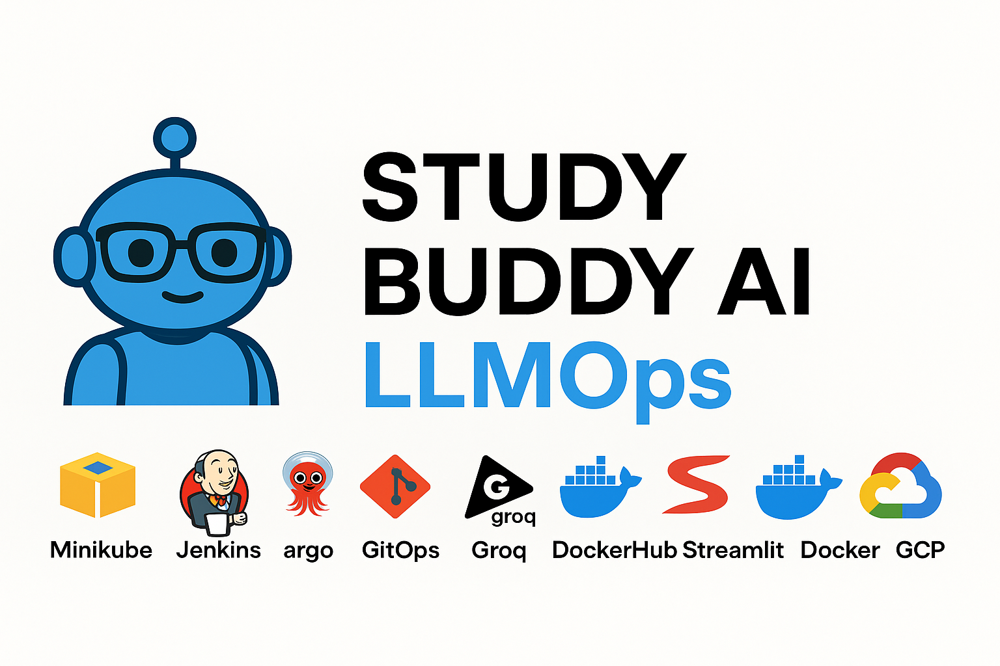

# 🎧 Study Buddy AI




**Study Buddy AI LLMOps** is an AI-powered learning assistant designed to generate, manage, and evaluate quizzes using Large Language Models (LLMs).  
It combines the simplicity of **Streamlit** for the user interface with modern **MLOps/LLMOps practices** like containerization, CI/CD pipelines, and cloud deployment to ensure scalability, automation, and reliability.  

---

## 🚀 Features

- 🎯 **Dynamic Quiz Generation**  
  Generate multiple-choice or fill-in-the-blank quizzes on any topic.

- 🧠 **Customizable Difficulty**  
  Choose between *Easy*, *Medium*, and *Hard* levels.

- 🔢 **Flexible Question Count**  
  Select the number of questions (1–10).

- 📝 **Interactive Quiz Attempt**  
  Answer questions directly in the web app.

- ✅ **Automatic Evaluation**  
  Results are scored instantly, with detailed feedback.

- 📊 **Result Export**  
  Save quiz results as CSV files and download them for later review.

---

## 🛠️ Tech Stack

1. **Groq** → *LLM (Free)*  

2. **DockerHub** → *Platform for storing our Docker images*  

3. **LangChain** → *Generative AI Framework to interact with LLM*  

4. **GIT-OPS** → *Deploy and manage infrastructure or applications using Git as the single source of truth*  

5. **Minikube** → *For making a Kubernetes Cluster where we can deploy our application*  

6. **Streamlit** → *To build the UI or frontend of the app*  

7. **Docker** → *For containerization of the app during deployment*  

8. **Jenkins** → *For making CI (Continuous Integration) part of CI/CD Pipeline*  

9. **ArgoCD** → *For making CD (Continuous Deployment) part of CI/CD Pipeline*  

10. **GCP VM** → *Virtual Machine that can be accesed on Google cloud *

11. **GitHub** → *It will work as a SCM for our Project* 


- [Streamlit](https://streamlit.io/) – UI framework  
- [Python 3.11+](https://www.python.org/) – Core language  
- [Pandas](https://pandas.pydata.org/) – Result data handling  
- [dotenv](https://pypi.org/project/python-dotenv/) – Environment variable management  
- LLM API (Groq / OpenAI compatible) – For generating quiz questions  

---

# 🏗️ System Architecture & Workflow (Flowchart)

```text
                ┌───────────────────────┐
                │   Project & API Setup │
                └───────────┬───────────┘
                            │
                ┌───────────▼───────────┐
                │   Configuration Code   │
                └───────────┬───────────┘
                            │
                ┌───────────▼───────────┐
                │ Question Schemas/Models│
                └───────────┬───────────┘
                            │
                ┌───────────▼───────────┐
                │  Prompt Templates Code │
                └───────────┬───────────┘
                            │
                ┌───────────▼───────────┐
                │  Groq Client Setup     │
                └───────────┬───────────┘
                            │
                ┌───────────▼───────────┐
                │ Question Generator Code│
                └───────────┬───────────┘
                            │
                ┌───────────▼───────────┐
                │   Helper Class Codes   │
                └────────────────────────┘


APPLICATION
────────────
    ┌─────────────────┐
    │ Main Application│
    └────────┬────────┘
             │
 VERSIONING & CONTAINERIZATION
 ─────────────────────────────
    ┌─────────────┐   ┌───────────────┐
    │ Code Version│──▶│   Dockerfile  │
    └─────────────┘   └───────────────┘


INFRASTRUCTURE & DEPLOYMENT
────────────────────────────
    ┌───────────────────────┐
    │ Kubernetes Manifests  │
    └───────────┬───────────┘
                │
    ┌───────────▼───────────┐
    │ GCP VM Instance Setup │
    └───────────────────────┘


CI/CD PIPELINE
───────────────
    ┌────────────┐
    │ Jenkins    │
    └──────┬─────┘
           │
    ┌──────▼──────┐
    │ GitHub +    │
    │ Jenkins     │
    └──────┬──────┘
           │
    ┌──────▼────────┐
    │ Build & Push  │
    │ Docker Image  │
    └──────┬────────┘
           │
    ┌──────▼───────┐
    │ ArgoCD Setup │
    └──────┬───────┘
           │
    ┌──────▼────────┐
    │ GitHub Webhooks│
    └───────────────┘


